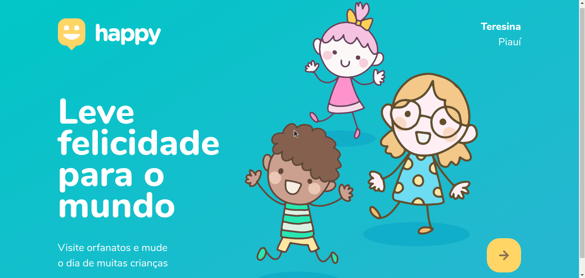
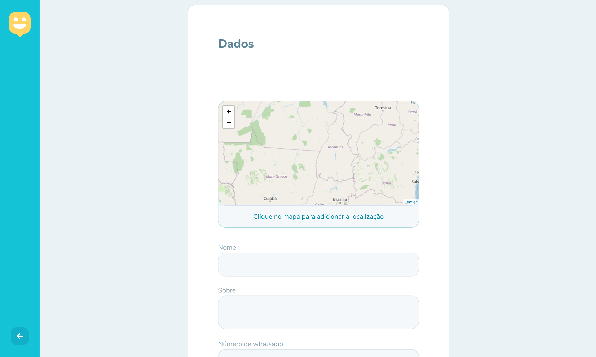

# NextLevelWeek-HappyWeb

<h1 align="center">
    
</h1>

<h2 align="center">
    
</h2>

## 🧑🏻‍💻 Tecnologias

Esse projeto foi desenvolvido utilizando as seguintes tecnologias:

- [Node.js](https://nodejs.org/en/)
- [Express](https://expressjs.com/pt-br/)
- [SQLite](https://www.sqlite.org/index.html)
- [handlebars](https://handlebarsjs.com/)

<h1 align="center">
    
</h1>

## 💻 Projeto

O Happy é um projeto que visa facilitar visitas aos orfanatos próximos a você 💜 

Este é um projeto desenvolvido durante a **[Next Level Week](https://nextlevelweek.com/)**, realizada pela **[@Rocketseat](https://github.com/Rocketseat)** durante os dias 12 a 18 de Outubro de 2020.

- [x] Formulário de cadatro

<h1 align="center">
    
</h1>

- [x] Detalhes do orfanato mais próximo

<h1 align="center">
    
</h1>

